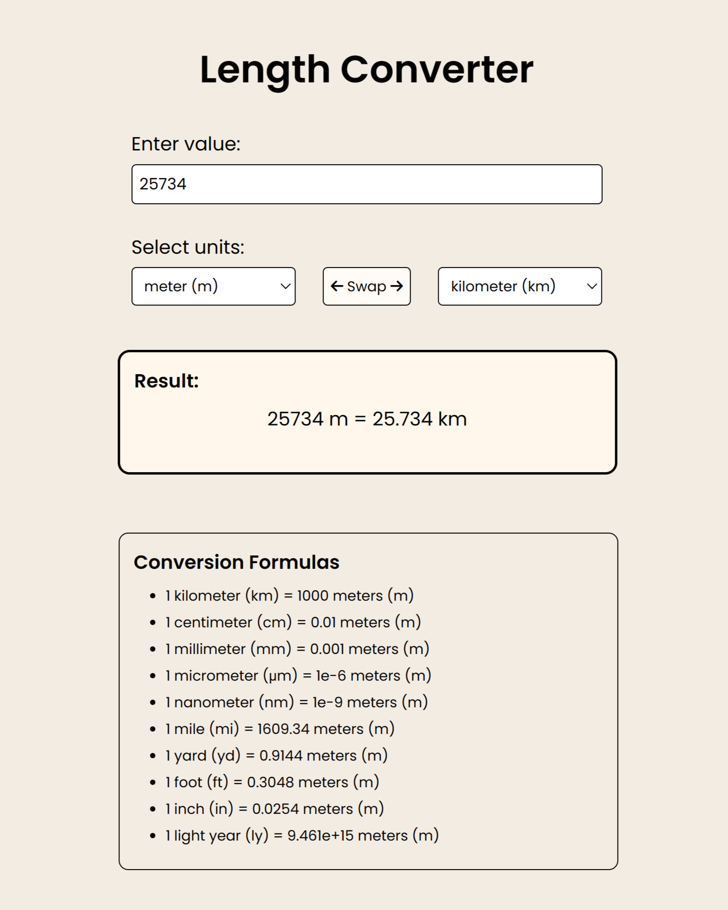

# Length Converter App

## *Description*

The Length Converter app is a tool that allows you to convert values between different units of length. You can quickly and easily convert measurements such as meters, kilometers, inches, feet, and more.

## *Features*

- Conversion between various units of length.
- Support for popular units, including meters, kilometers, centimeters, inches, yards, and more.
- Option to swap source and target units for convenience.
- Interactive user interface with automatic result updates.

## *How to Use*

1. Enter the value you want to convert in the "Enter value" field.
2. Select the source and target units from the dropdown lists.
3. The conversion result will be updated in real-time.

**Additional Features:**
- Swap Units: Click the "Swap" button to reverse the source and target units.

## *Installation*

1. Download the application files to your computer.
2. Open the `index.html` file in any web browser.
